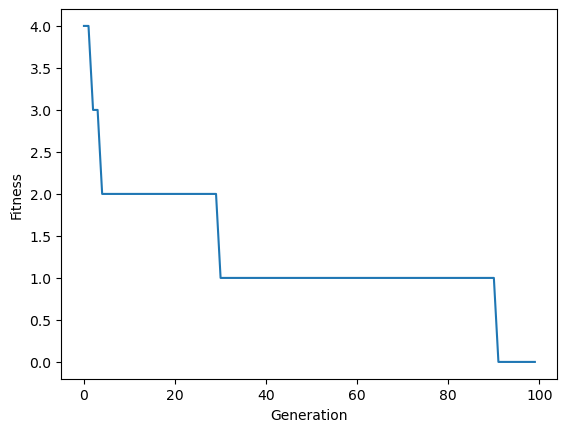

## **Example 1**: String Matching with Grammatical Evolution on Jupyter Notebook


!!! info "Starter Project"
    To run this example, create a new finchGE project:

    ```bash
    finchge new my_experiment --notebook
    ```

    Then find the notebook (```starter.ipynb```) in ```my_experiment/notebooks``` folder.


This example demonstrates how to use **finchGE** interactively to solve a simple but illustrative
problem: **string matching using Grammatical Evolution**.

The goal is to evolve a string that exactly matches a given target string by defining:

- a grammar that generates candidate strings,
- a fitness function that measures similarity to the target,
- and a genetic algorithm that drives evolution.

Although the problem itself is simple, it showcases the Grammatical Evolution pipeline and
illustrates how finchGE components can be composed programmatically.


### Problem Description

Given a target string (e.g. `"finch"`), the objective is to evolve a candidate string such that:

- characters match the target at corresponding positions,
- string length is taken into account,
- fitness is minimized when the match is exact.

This is a classical introductory problem for Grammatical Evolution because:

- the grammar defines a structured search space,
- the genotype-phenotype mapping is explicit,
- fitness is easy to interpret and debug.

---

### Random Seed

In finchGE, same RNG is shared across modules to ensure reproducibility.

```python
RANDOM_SEED = 67
```


### Grammar Definition

The grammar defines the space of valid strings that evolution can explore.

``` python
from finchge.grammar import Grammar

grammar_str = """
<string> ::= <letter> | <letter> <string>
<letter> ::= _ | [a-z]
"""

grammar = Grammar(grammar_str)

```
The defined grammar can be displayed using ```describe``` function.

```python
grammar.describe()
```

The output of describe as shown below:

Grammar:
<div> <b style="color: #d33682;"&gt;</b>&lt;string&gt;</b>
<span style="color: #666;">::=</span>
<span style="color: #268bd2;"><b style="color: #d33682;"&gt;</b>&lt;letter&gt;</b>
<span style="color: #859900;">|</span> <b style="color: #d33682;"&gt;</b>&lt;letter&gt;</b>
<b style="color: #d33682;"&gt;</b>&lt;string&gt;</b></span><br><b style="color: #d33682;"&gt;</b>&lt;letter&gt;</b>
<span style="color: #666;">::=</span> <span style="color: #268bd2;">_ <span style="color: #859900;">|</span> a
<span style="color: #859900;">|</span> b <span style="color: #859900;">|</span> c <span style="color: #859900;">|</span> d
<span style="color: #859900;">|</span> e <span style="color: #859900;">|</span> f <span style="color: #859900;">|</span> g
<span style="color: #859900;">|</span> h <span style="color: #859900;">|</span> i <span style="color: #859900;">|</span> j
<span style="color: #859900;">|</span> k <span style="color: #859900;">|</span> l <span style="color: #859900;">|</span> m
<span style="color: #859900;">|</span> n <span style="color: #859900;">|</span> o <span style="color: #859900;">|</span> p
<span style="color: #859900;">|</span> q <span style="color: #859900;">|</span> r <span style="color: #859900;">|</span> s
<span style="color: #859900;">|</span> t <span style="color: #859900;">|</span> u <span style="color: #859900;">|</span> v
<span style="color: #859900;">|</span> w <span style="color: #859900;">|</span> x <span style="color: #859900;">|</span> y
<span style="color: #859900;">|</span> z</span><br /><br />
</div>


| Description             | Value          |
|-------------------------|----------------|
| Number of Rules         | 2              |
| Start Rule              | **`<string>`** |
| Number of Terminals     | 27             |
| Number of Non-Terminals | 2              |
| Max Arity               | 2              |
| Can Terminate           | **True**       |
| Start Min Depth         | 2              |
| Start Max Depth         | Inf            |
| Recursive Rules         | 1              |


### Configuring Genetic Operators

finchGE exposes genetic operators as independent components.
Here we explicitly configure selection, crossover, mutation, and replacement.

```python
from finchge.operators.selection import RouletteWheelSelection
from finchge.operators.crossover import OnePointCrossover
from finchge.operators.mutation import IntFlipMutation
from finchge.operators.replacement import GenerationalReplacement


selection = RouletteWheelSelection(max_best=False)
crossover = OnePointCrossover(codon_size=127, crossover_proba=0.5)
mutation = IntFlipMutation(mutation_probability=0.01, codon_size=127)
replacement = GenerationalReplacement(max_best=False)

```

### Defining the Fitness Function

We use `StringMatchFitness` defined available in finchGE for this example.
The fitness value represents the number of mismatched characters plus any length difference.
Lower fitness values are better, with zero indicating a perfect match.

```python
from finchge.fitness import StringMatchFitness

stringmatch_fitness  = StringMatchFitness(target="hello")
```

*FinchGE includes some common fitness functions. For specific experiments,
a custom fitness function can be created by subclassing `GEFitnessFunction` class.*


### Setting up FitnessEvaluator

Fitness Evaluator handles the fitness evaluation


```python

from finchge.grammar.mapper import GenotypeMapper
from finchge.fitness import FitnessEvaluator

# Initialize mapper for fitness evaluator
mapper = GenotypeMapper(grammar=grammar,
                            max_wraps=6,
                            max_recursion_depth=20)
# Initialize Fitness Evaluator
fitness_evaluator = FitnessEvaluator(
    fitness_functions=stringmatch_fitness,
    mapper=mapper
)

```

### Constructing the Genetic Algorithm

The genetic algorithm is assembled by composing the operators.

```python
from finchge.algorithm import GeneticAlgorithm

ga = GeneticAlgorithm(
    selection=selection,
    crossover=crossover,
    mutation=mutation,
    replacement=replacement,
    elite_size=3,
    fitness_evaluator=fitness_evaluator,
    random_state=RANDOM_SEED
)

```
At this level, the algorithm is grammar-agnostic and problem-agnostic.

### Population Initialisation and Evaluation

We now create an initial population and evaluate it.

```python
from finchge.initialisation import RandomGenomeInitialiser
from finchge.core.population import Population


initializer = RandomGenomeInitialiser(genome_length=100, codon_size=127)
population = Population(initialiser=initializer, population_size=100)

```

### Running Evolution Interactively

We evolve the population manually generation by generation.

```python
from tqdm import tqdm
fitness_history = []
fitness_evaluator.evaluate_population(population)

for generation in tqdm(range(100)):
    population = ga.evolve_one_generation(population)
    best = ga.get_best_individual(population)
    fitness_history.append(best)
```

100%|███████████████████████████████████| 100/100


This explicit loop allows full control over the evolutionary process and makes it easy to
inspect intermediate results or modify parameters dynamically.


### Inspecting the Best Individual

After evolution completes, we can inspect the best individual found in the final generation.


```python

best_individual = fitness_history[-1]
best_individual

```


The best individual is displayed as below.


Individual:
<div> <table>
<thead>
<tr><th>Attribute  </th><th>Value  </th></tr>
</thead>
<tbody>
<tr><td>Phenotype  </td><td>hello  </td></tr>
<tr><td>Genotype   </td><td>[107  35  83   5  47  93  47  93  30  69  82  93  52  69  47  93  49  69
  31  51  23  47  92 114  39  39  15  28  96  56 102  83 109 102 123  24
   0  89   6  29  60   6  85 109  31  53  16  99 124  59  27 106  82 101
  14  57  49   9 101 118 120  83  96  23 112  32  66  88  98  76  80  34
   5 127 123  71  35  62  96  33  80  93  41  46  25  41  72  20  16  93
 110  63 104 112 107  98   6   2  51 126   6  28  44  82   9  30 111  11
  31  25  62  82  14  13]        </td></tr>
<tr><td>Used Codons</td><td>10     </td></tr>
<tr><td>Fitness    </td><td>[0]    </td></tr>
</tbody>
</table>
</div>


### Visualizing Fitness Progress

Fitness progression across generations can be visualized to analyze convergence behavior.

```python
import pandas as pd
import matplotlib.pyplot as plt
import seaborn as sns

df = pd.DataFrame({
    "Generation": range(len(fitness_history)),
    "Fitness": [ind.fitness[0] for ind in fitness_history]
})

sns.lineplot(data=df, x="Generation", y="Fitness")
plt.show()
```



### Summary

This example demonstrates how finchGE can be used interactively to solve a simple
string matching problem using Grammatical Evolution.

This example includes:

- explicit grammar-based genotype-phenotype mapping,
- problem-specific fitness definition,
- modular composition of genetic operators,
- generation-level control over evolution,
- programmatic inspection and analysis of results.

Although the string matching problem is simple, the same workflow applies directly to
more complex Grammatical Evolution tasks such as symbolic regression, program synthesis,
and structured optimization problems.


---
