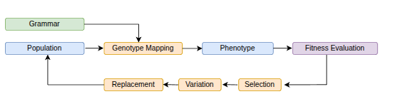

## Grammatical Evolution

Grammatical Evolution is a type of genetic programming where solutions are generated and evolved using [grammars](grammar.md) (like BNF grammars).
It is primarily used for evolving programs or expressions in a structured way, guided by grammar rules and evolutionary operators.
It is often used in [symbolic regression](symbolic_regression.md), automated programming, and other optimization tasks.

At a high level, Grammatical Evolution searches over integer genomes and uses a grammar to map those genomes into valid programs, expressions, rules, or policies. The generated output is evaluated on a task, assigned a fitness value, and then improved over generations using evolutionary search.

## The GE Pipeline

A typical Grammatical Evolution run follows this loop:

In this process:

- A [population](fitness_and_populations.md) of candidate genomes is created.
- Each genome is mapped through the grammar to produce a phenotype.
- The phenotype is executed or evaluated for the target problem.
- [Fitness values](fitness_and_populations.md) guide which individuals are selected.
- [Crossover and mutation](operators.md) create new candidate solutions.
- [Replacement](operators.md) forms the next generation.

This loop continues until the experiment reaches a stopping condition, such as a fixed number of generations or an acceptable fitness value.

## Genotype, Grammar, and Phenotype

Grammatical Evolution separates the representation being evolved from the final solution that is evaluated.

- **Genotype**: the internal genetic representation, usually a list of integer codons.
- **Grammar**: the set of production rules that controls how genomes are translated.
- **Phenotype**: the generated output, such as a mathematical expression, program, model structure, or control policy.

This separation allows the evolutionary algorithm to operate on a simple genetic representation while still producing structured outputs for different domains.

## Why Use a Grammar?

The grammar defines the search space. It constrains evolution to generate syntactically valid outputs and allows domain knowledge to be included directly in the representation.

Using a grammar can help with:

- keeping generated solutions valid by construction
- controlling the shape and complexity of evolved programs
- limiting the search to meaningful domain-specific structures
- making evolved outputs easier to inspect and interpret
- reusing the same evolutionary machinery across different problem types

The grammar does not define what makes a solution good. That is the role of the fitness function.

## Where FinchGE Fits

finchGE exposes the main parts of Grammatical Evolution as explicit, reusable components. Instead of hiding grammar parsing, mapping, initialization, variation, fitness evaluation, [logging](experiment_utilities.md), and [checkpointing](experiment_utilities.md) inside one monolithic routine, finchGE keeps these responsibilities separate.

This makes it easier to:

- change one part of the evolutionary process without rewriting the whole experiment
- compare initialization methods, operators, and algorithms
- build reproducible experiment workflows
- use GE for symbolic regression, control, logic, and custom [benchmark problems](benchmarks.md)
- inspect intermediate representations such as genomes, derivation trees, and phenotypes

## Common Use Cases

Grammatical Evolution is useful when candidate solutions must follow a structure that can be described by a grammar. Common examples include:

- symbolic regression
- program synthesis
- rule discovery
- evolving control policies
- benchmark studies in genetic programming
- structured model or pipeline search

## Practical Limitations

Grammar design has a strong effect on the behavior of the search. A grammar that is too restrictive may prevent useful solutions from being discovered, while a grammar that is too broad may make the search unnecessarily difficult.

It is also important to remember that syntactic validity does not guarantee useful behavior. The fitness function, training data, evaluation protocol, and evolutionary settings all influence the quality and scientific reliability of an experiment.

Recursive grammars can also produce very large expressions or programs if not controlled carefully. In practice, depth limits, initialization strategy, bloat control, and fitness design are important parts of a well-designed GE experiment.
